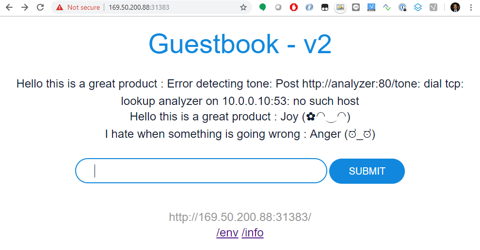

## IBM Cloud Container Workshop

## Guestbook Hybrid Deployment

This example shows how to build a simple hybrid multi-tier web application using ICP and IBM Cloud services. 

The application consists of a web front end, Redis master for storage, and replicated set of Redis slaves, all for which we will create Kubernetes replication controllers, pods, and services and an analyser service which is connected to It also cont

##### Table of Contents

 * [Prerequisites](#prerequisites)
 * [Create the Redis master pod](#create-the-redis-master-pod)
 * [Create the Redis master service](#create-the-redis-master-service)
 * [Create the Redis slave pods](#create-the-redis-slave-pods)
 * [Create the Redis slave service](#create-the-redis-slave-service)
 * [Create the guestbook pods](#create-the-guestbook-pods)
 * [Create the guestbook service](#create-the-guestbook-service)
 * [Use Watson Tone Analyzer on IBM Cloud](#Use Watson Tone Analyzer on IBM Cloud)
 * [View the guestbook](#view-the-guestbook)
 * [Cleanup](#cleanup)

### Prerequisites

This lab assumes that you ICP installed and configured.


First run the following command to connect to your ICP instance :

`~/connect2icp.sh`

Go to your home directory : 

`cd`

Then Clone the ICPGuestbook git repo : 

`git clone https://github.com/fdescollonges/ICPGuestbook.git`


### Create the Redis master pod

Use the `redis-master-deployment.yaml` file to create a [deployment](https://kubernetes.io/docs/concepts/workloads/controllers/deployment/) and Redis master [pod](https://kubernetes.io/docs/concepts/workloads/pods/pod-overview/). The pod runs a Redis key-value server in a container. Using a replication controller is the preferred way to launch long-running pods, even for 1 replica, so that the pod benefits from the self-healing mechanism in Kubernetes (keeps the pods alive).

1. Use the [redis-master-deployment.yaml](redis-master-deployment.yaml) file to create the Redis master replication controller in your Kubernetes cluster by running the `kubectl apply -f` *`filename`* command:

    ```console
    root@iccws101:~/ICPGuestbook# kubectl apply -f redis-master-deployment.yaml
    deployment.apps/redis-master created
    ```

2. To verify that the redis-master controller is up, list the replication controllers you created in the cluster with the `kubectl get deployment` command (if you don't specify a `--namespace`, the `default` namespace will be used. The same below):

    ```console
    root@iccws101:~/ICPGuestbook# kubectl get deployment
    NAME           DESIRED   CURRENT   UP-TO-DATE   AVAILABLE   AGE
    redis-master   1         1         1            1           51s
    
    ```

    Result: The replication controller then creates the single Redis master pod.

3. To verify that the redis-master pod is running, list the pods you created in cluster with the `kubectl get pods` command:

    ```console
    root@iccws101:~/ICPGuestbook# kubectl get pods
    NAME                            READY   STATUS    RESTARTS   AGE
    redis-master-7b5cc58fc8-x6m2b   1/1     Running   0          54m
    
    ...
    ```

    Result: You'll see a single Redis master pod and the machine where the pod is running after the pod gets placed (may take up to thirty seconds).

### Create the Redis master service

A Kubernetes [service](https://kubernetes.io/docs/concepts/services-networking/service/) is a named load balancer that proxies traffic to one or more pods. The services in a Kubernetes cluster are discoverable inside other pods via environment variables or DNS.

Services find the pods to load balance based on pod labels. The pod that you created in previous step has the label `app=redis` and `role=master`. The selector field of the service determines which pods will receive the traffic sent to the service.

1. Use the [redis-master-service.yaml](redis-master-service.yaml) file to create the service in your Kubernetes cluster by running the `kubectl apply -f` *`filename`* command:

    ```console
    root@iccws101:~/ICPGuestbook# kubectl apply -f redis-master-service.yaml
    service/redis-master created
    ```

2. To verify that the redis-master service is up, list the services you created in the cluster with the `kubectl get services` command:

    ```console
    root@iccws101:~/ICPGuestbook# kubectl get services
    NAME           TYPE        CLUSTER-IP    EXTERNAL-IP   PORT(S)    AGE
    kubernetes     ClusterIP   10.0.0.1      <none>        443/TCP    47h
    redis-master   ClusterIP   10.0.14.216   <none>        6379/TCP   99s
    
    ```

    Result: All new pods will see the `redis-master` service running on the host (`$REDIS_MASTER_SERVICE_HOST` environment variable) at port `6379`, or running on `redis-master:6379`. After the service is created, the service proxy on each node is configured to set up a proxy on the specified port (in our example, that's port `6379`).


### Create the Redis slave pods

The Redis master we created earlier is a single pod (REPLICAS = 1), while the Redis read slaves we are creating here are 'replicated' pods. In Kubernetes, a deployment is responsible for managing the multiple instances of a replicated pod.

1. Use the file [redis-slave-deployment.yaml](redis-slave-deployment.yaml) to create the deployment by running the `kubectl apply -f` *`filename`* command:

    ```console
    root@iccws101:~/ICPGuestbook# kubectl apply -f redis-slave-deployment.yaml
    Error from server (InternalError): error when creating "redis-slave-deployment.yaml": Internal error occurred: admission webhook "trust.hooks.securityenforcement.admission.cloud.ibm.com" denied the request:
    Deny "docker.io/kubernetes/redis-slave:v2", no matching repositories in ClusterImagePolicy and no ImagePolicies in the "default" namespace
    ```

    With ICP, you can restrict the repositories from which your developpers can pull base images. In order to make Redis slaves to run, we have to add several repository to the image policies.

2. Create a ImagePolicy file : 

    `nano guestbook-imagepolicy.yaml`

```yaml
apiVersion: securityenforcement.admission.cloud.ibm.com/v1beta1
kind: ImagePolicy
metadata:
  generation: 1
  name: guestbookimagepolicy
  namespace: default
  resourceVersion: "218506"
  selfLink: /apis/securityenforcement.admission.cloud.ibm.com/v1beta1/namespaces/guestbook/imagepolicies/guestbookimagepolicy
  uid: df3fd7f3-4a46-11e9-969c-06f6c97769e8
spec:
  repositories:
  - name: docker.io/kubernetes/*
    policy:
      va:
        enabled: false
  - name: docker.io/ibmcom/*
    policy:
      va:
        enabled: false
  - name: mycluster.icp:8500/guestbook/*
    policy:
      va:
        enabled: false
```

​	Hit `ctrl-o`, `Enter` then `ctrl-x` to save the file

​	Apply this file :

​	`kubectl apply -f guestbook-imagepolicy.yaml`

```
root@iccws101:~/ICPGuestbook# kubectl apply -f guestbook-imagepolicy.yaml
imagepolicy.securityenforcement.admission.cloud.ibm.com/guestbookimagepolicy created
```

Re execute  `kubectl apply -f redis-slave-deployment.yaml` to create the Redis slave deployment.

```console
root@iccws101:~/ICPGuestbook# kubectl apply -f redis-slave-deployment.yaml
deployment.apps/redis-slave created
```


1. To verify that the redis-slave deployment is running, run the `kubectl get deployment` command:

    ```console
    root@iccws101:~/ICPGuestbook# kubectl get deployment
    NAME           DESIRED   CURRENT   UP-TO-DATE   AVAILABLE   AGE
    redis-master   1         1         1            1           21m
    redis-slave    2         2         2            2           5m24s
    
    ```

    Result: The replication controller creates and configures the Redis slave pods through the redis-master service (name:port pair, in our example that's `redis-master:6379`).

    Example:
    The Redis slaves get started by the replication controller with the following command:

    ```console
    redis-server --slaveof redis-master 6379
    ```

2. To verify that the Redis master and slaves pods are running, run the `kubectl get pods` command:

    ```console
    root@iccws101:~/ICPGuestbook# kubectl get pods
    NAME                            READY   STATUS    RESTARTS   AGE
    redis-master-7b5cc58fc8-phhdh   1/1     Running   0          21m
    redis-slave-5db5dcfdfd-2mx4j    1/1     Running   0          5m48s
    redis-slave-5db5dcfdfd-q6gfz    1/1     Running   0          5m48s
    
    ```

    Result: You see the single Redis master and two Redis slave pods.

### Create the Redis slave service

Just like the master, we want to have a service to proxy connections to the read slaves. In this case, in addition to discovery, the Redis slave service provides transparent load balancing to clients.

1. Use the [redis-slave-service.yaml](redis-slave-service.yaml) file to create the Redis slave service by running the `kubectl create -f` *`filename`* command:

    ```console
    root@iccws101:~/ICPGuestbook# kubectl create -f redis-slave-service.yaml
    service/redis-slave created
    ```

2. To verify that the redis-slave service is up, list the services you created in the cluster with the `kubectl get services` command:

    ```console
    root@iccws101:~/ICPGuestbook# kubectl get services
    NAME           TYPE        CLUSTER-IP     EXTERNAL-IP   PORT(S)    AGE
    kubernetes     ClusterIP   10.0.0.1       <none>        443/TCP    47h
    redis-master   ClusterIP   10.0.14.216    <none>        6379/TCP   24m
    redis-slave    ClusterIP   10.0.186.203   <none>        6379/TCP   42s
    ```

    Result: The service is created with labels `app=redis` and `role=slave` to identify that the pods are running the Redis slaves.

Tip: It is helpful to set labels on your services themselves--as we've done here--to make it easy to locate them later.

### Create the guestbook pods

This is a simple Go `net/http` ([negroni](https://github.com/codegangsta/negroni) based) server that is configured to talk to either the slave or master services depending on whether the request is a read or a write. The pods we are creating expose a simple JSON interface and serves a jQuery-Ajax based UI. Like the Redis slaves, these pods are also managed by a deployment.

1. Use the [guestbook-deployment.yaml](guestbook-deployment.yaml) file to create the guestbook deployment by running the `kubectl apply -f` *`filename`* command:

    ```console
    root@iccws101:~/ICPGuestbook# kubectl apply -f guestbook-deployment.yaml
    deployment.apps/guestbook-v2 created
    ```

 Tip: If you want to modify the guestbook code it can be found in the `guestbook` directory, along with its Makefile. If you have pushed your custom image be sure to update the `image` property accordingly in the guestbook-deployment.yaml.

2. To verify that the guestbook replication controller is running, run the `kubectl get deployment` command:

    ```console
    root@iccws101:~/ICPGuestbook# kubectl get deployment
    NAME           DESIRED   CURRENT   UP-TO-DATE   AVAILABLE   AGE
    guestbook-v2   3         3         3            3           57s
    redis-master   1         1         1            1           102m
    redis-slave    2         2         2            2           86m
    ```

3. To verify that the guestbook pods are running (it might take up to thirty seconds to create the pods), list the pods you created in cluster with the `kubectl get pods` command:

    ```console
    root@iccws101:~/ICPGuestbook# kubectl get pods
    NAME                            READY   STATUS    RESTARTS   AGE
    guestbook-v2-96f8b7fb8-5rfpw    1/1     Running   0          105s
    guestbook-v2-96f8b7fb8-srcrx    1/1     Running   0          105s
    guestbook-v2-96f8b7fb8-zlt84    1/1     Running   0          105s
    redis-master-7b5cc58fc8-phhdh   1/1     Running   0          103m
    redis-slave-5db5dcfdfd-2mx4j    1/1     Running   0          87m
    redis-slave-5db5dcfdfd-q6gfz    1/1     Running   0          87m
    
    ```

    Result: You see a single Redis master, two Redis slaves, and three guestbook pods.

### Create the guestbook service

Just like the others, we create a service to group the guestbook pods but this time, to make the guestbook front end externally visible, we specify `"type": "LoadBalancer"`.

1. Use the [guestbook-service.yaml](guestbook-service.yaml) file to create the guestbook service by running the `kubectl apply -f` *`filename`* command:

    ```console
    root@iccws101:~/ICPGuestbook# kubectl apply -f guestbook-service.yaml
    service/guestbook created
    ```

2. To verify that the guestbook service is up, list the services you created in the cluster with the `kubectl get services` command:

    ```console
    $ kubectl get services
    NAME              CLUSTER_IP       EXTERNAL_IP       PORT(S)       SELECTOR               AGE
    guestbook         10.0.217.218     146.148.81.8      3000/TCP      app=guestbook          1h
    redis-master      10.0.136.3       <none>            6379/TCP      app=redis,role=master  1h
    redis-slave       10.0.21.92       <none>            6379/TCP      app-redis,role=slave   1h
    ...
    ```

    Result: The service is created with label `app=guestbook`.

### Use Watson Tone Analyzer on IBM Cloud

    Watson Tone Analyzer detects the tone from the words that users enter into the Guestbook app. The tone is converted to the corresponding emoticons.

    1. Install the IBM Cloud [command line interface](https://console.bluemix.net/docs/cli/reference/bluemix_cli/get_started.html#getting-started) to access IBM Cloud public on your virtual server :

       `curl -sL https://ibm.biz/idt-installer | bash`

    2. Log in to the IBM Cloud CLI  using your IBM ID created in [https://github.com/fdescollonges/ContainerWkshp/blob/master/1-PrepareLab.md](https://github.com/fdescollonges/ContainerWkshp/blob/master/1-PrepareLab.md)

       ```
       root@iccws101:~/ICPGuestbook# ibmcloud login
       ```

       ```bash
       root@iccws101:~/ICPGuestbook# ibmcloud login
       API endpoint: cloud.ibm.com
       
       Email> tufih@mailfavorite.com
       
       Password>
       Authenticating...
       OK
       
       Targeted account ICCWS ICCWS's Account (95f04fe00e284449bd3990ee72688be3)
       
       Targeted resource group Default
       
       
       Select a region (or press enter to skip):
       1. au-syd
       2. jp-tok
       3. eu-de
       4. eu-gb
       5. us-south
       6. us-east
       Enter a number> 5
       Targeted region us-south
       
       
       API endpoint:      https://cloud.ibm.com
       Region:            us-south
       User:              tufih@mailfavorite.com
       Account:           ICCWS ICCWS's Account (95f04fe00e284449bd3990ee72688be3)
       Resource group:    Default
       CF API endpoint:
       Org:
       Space:
       
       Tip: If you are managing Cloud Foundry applications and services
       - Use 'ibmcloud target --cf' to target Cloud Foundry org/space interactively, or use 'ibmcloud target --cf-api ENDPOINT -o ORG -s SPACE' to target the org/space.
       - Use 'ibmcloud cf' if you want to run the Cloud Foundry CLI with current IBM Cloud CLI context.
       
       ```

       

    3. Create Watson Tone Analyzer in your account.

       ```
       ibmcloud resource service-instance-create my-tone-analyzer-service tone-analyzer lite us-south
       ```

       ```bash
       root@iccws101:~/ICPGuestbook# ibmcloud resource service-instance-create my-tone-analyzer-service tone-analyzer lite us-south
       Creating service instance my-tone-analyzer-service in resource group Default of account ICCWS ICCWS's Account as tufih@mailfavorite.com...
       OK
       Service instance my-tone-analyzer-service was created.
       
       Name:                                my-tone-analyzer-service
       ID:                                  crn:v1:bluemix:public:tone-analyzer:us-south:a/95f04fe00e284449bd3990ee72688be3:f755c4fa-be4a-4c9f-9b66-45773412abb0::
       GUID:                                f755c4fa-be4a-4c9f-9b66-45773412abb0
       Location:                            us-south
       State:                               active
       Type:                                service_instance
       Sub Type:
       External Service Endpoint Enabled:   false
       Internal Service Endpoint Enabled:   false
       Created at:                          2019-03-28T14:16:26Z
       Updated at:                          2019-03-28T14:16:26Z
       ```

    4. Create the service key for the Tone Analyzer service. This command should output the credentials you just created. You will need the value for **apikey** & **url** later.

       ```
       ibmcloud resource service-key-create tone-analyzer-key Manager --instance-name my-tone-analyzer-service
       ```

       ```bash
       root@iccws101:~/ICPGuestbook# ibmcloud resource service-key-create tone-analyzer-key Manager --instance-name my-tone-analyzer-service
       Creating service key of service instance my-tone-analyzer-service under account ICCWS ICCWS's Account as tufih@mailfavorite.com...
       AAA: de2d50dd82ac4a19aa30a74a5807afdb
       OK
       Service key crn:v1:bluemix:public:tone-analyzer:us-south:a/95f04fe00e284449bd3990ee72688be3:f755c4fa-be4a-4c9f-9b66-45773412abb0:resource-key:738cecf2-c140-410d-ba68-d4d81658a1b8 was created.
       
       Name:          tone-analyzer-key
       ID:            crn:v1:bluemix:public:tone-analyzer:us-south:a/95f04fe00e284449bd3990ee72688be3:f755c4fa-be4a-4c9f-9b66-45773412abb0:resource-key:738cecf2-c140-410d-ba68-d4d81658a1b8
       Created At:    Thu Mar 28 14:17:23 UTC 2019
       State:         active
       Credentials:
                      iam_apikey_name:          auto-generated-apikey-738cecf2-c140-410d-ba68-d4d81658a1b8
                      iam_role_crn:             crn:v1:bluemix:public:iam::::serviceRole:Manager
                      iam_serviceid_crn:        crn:v1:bluemix:public:iam-identity::a/95f04fe00e284449bd3990ee72688be3::serviceid:ServiceId-bb3e3496-7a4f-4326-aa07-235774946f6e
                      url:                      https://gateway.watsonplatform.net/tone-analyzer/api
                      apikey:                   xxxx-xxxxxxxxxxxxxxxxxxxxxxxxxxxxxxxxxxxxxxxx
                      iam_apikey_description:   Auto generated apikey during resource-key operation for Instance - crn:v1:bluemix:public:tone-analyzer:us-south:a/95f04fe00e284449bd3990ee72688be3:f755c4fa-be4a-4c9f-9b66-45773412abb0::
       
       ```

    5. If you need to get the service-keys later, you can use the following command:

       ```
       ibmcloud resource service-key tone-analyzer-key
       ```

    6. Open the `analyzer-deployment.yaml` and find the env section near the end of the file. Replace `YOUR_API_KEY` with your own API key, and replace `YOUR_URL` with the url value you saved before. YOUR_URL should look something like `https://gateway.watsonplatform.net/tone-analyzer/api`. Save the file.

    7. Deploy the analyzer pods using the `analyzer-deployment.yaml`  : 

       ```
       root@iccws101:~/ICPGuestbook# kubectl apply -f analyzer-deployment.yaml
       deployment.apps/analyzer created
       ```

       Create the analyzer service using  `analyzer-service.yaml` :

       ```
       root@iccws101:~/ICPGuestbook# kubectl apply -f analyzer-service.yaml
       service/analyzer created
       ```

    Great! Your hybrid guestbook application is up and running, accessing Tone 

### View the guestbook

You can now play with the guestbook that you just created by opening it in a browser (it might take a few moments for the guestbook to come up).

1. To view the guestbook on a remote host, locate the external IP of the load balancer in the **IP** column of the `kubectl get services` output. In our example, the internal IP address is `10.0.217.218` and the external IP address is `146.148.81.8` (*Note: you might need to scroll to see the IP column*).

2. Append port `3000` to the IP address (for example `http://146.148.81.8:3000`), and then navigate to that address in your browser.

Result: The guestbook displays in your browser:




### Cleanup

After you're done playing with the guestbook, you can cleanup by deleting the guestbook service and removing the associated resources that were created, including load balancers, forwarding rules, target pools, and Kubernetes replication controllers and services.

Delete all the resources by running the following `kubectl delete -f .` command:

```console
$ kubectl delete -f .
replicationcontroller "guestbook" deleted
service "guestbook" deleted
replicationcontroller "redis-master" deleted
service "redis-master" deleted
replicationcontroller "redis-slave" deleted
service "redis-slave" deleted
```

# IBM Cloud Container Workshop
